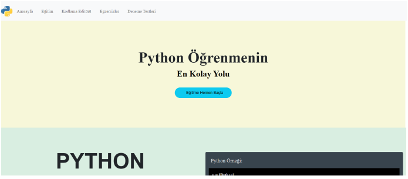
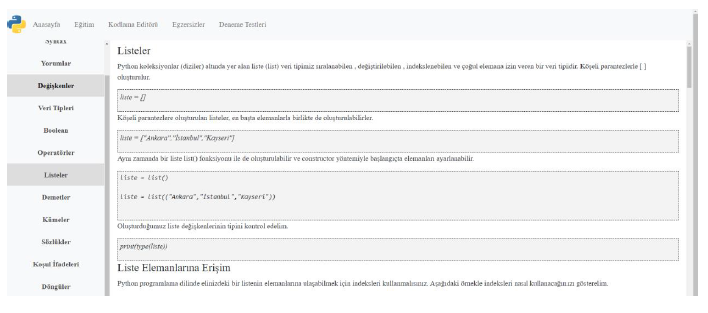
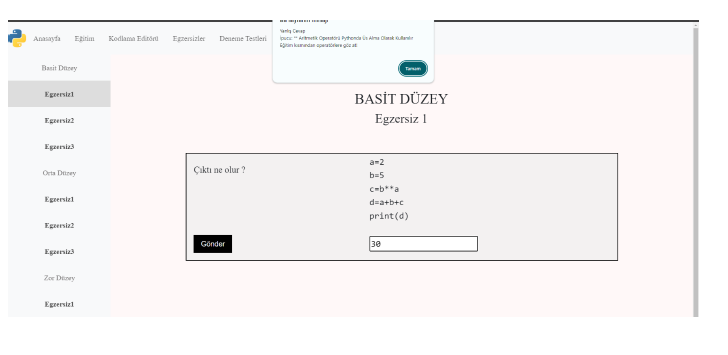
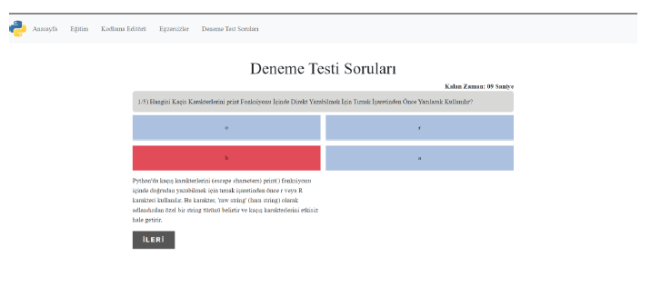
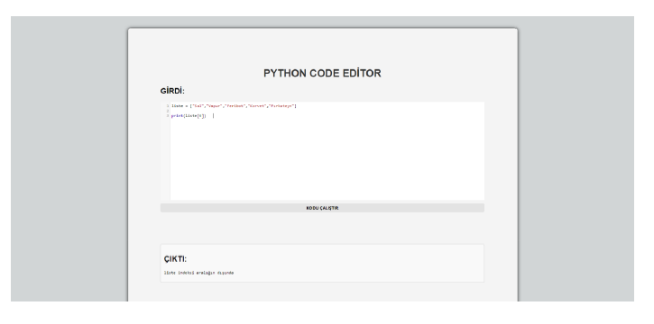

# PythonEdu
This project aims to provide an interactive and engaging platform for those who want to learn the Python programming language. The application aims to enable users to learn the basic concepts and syntax of Python, do practical exercises and test their code.
# Features
+ Basic and up-to-date training material
+ Python lessons at different difficulty levels
+ Interactive code editor and debugger
+ Exercises and tests
+ User-friendly interface
# Technologies Used
+ Frontend: HTML, CSS, JavaScript
+ Other: Python, Django
# ScreenShots
 

  
  
  
  
  

